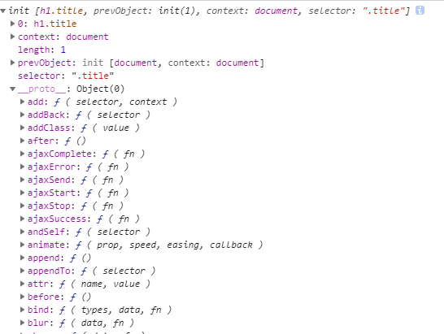

# 1.3 类数组对象结构

#### 为什么是类数组对象？

jQuery 为什么能像数组一样操作，通过对象 get 方法或者直接通过下标索引就能转换成 DOM 对象

首先，我们看 jQuery 的入口都是统一的`$`,通过传递参数的不同，实现了 9 种方法的重载：

```
jQuery([selector,[context]])
jQuery(element)
jQuery(elementArray)
jQuery(object)
jQuery(jQuery object)

jQuery(html,[ownerDocument])
jQuery(html,[attributes])

jQuery()
jQuery(callback)
```

9 种用法整体来说可以分三大块：选择器、dom 处理、dom 加载。

换句话说 jQuery 就是为了获取 dom、操作 dom 而存在的。所以为了更方便这些操作，让节点与实例对象通过一个桥梁关联起来，jQuery 内部就采用了一种叫“类数组对象”的方式作为存储结构，所以我们既可以像对象一样处理 jQuery 操作，也能够像数组一样可以使用 push,pop,shift,unshift,sort,each,map 等类数组的方法操作 jQuery 对象了。

#### jQuery 对象可用数组下标索引是什么原理？

通过 `$(".class")` 构建的对象结构如下所示：



整个结构很明了，通过对象键值对的关系保存着属性，原型保存着方法。
