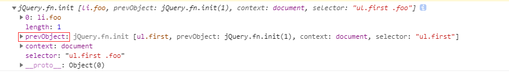

## 回溯处理的设计

在这一小节我们来了解一下`jQuery`对`DOM`进行遍历背后的工作机制，这样可以在编写代码时有意识地避免一些不必要的重复操作，从而提升代码的性能。

**关于jQuery对象的包装**
```
var $foo = $('ul.first').find('.foo')
```
通过对`sizzle选择器`的分析，我们可以得知`jQuery`选择器最终都是通过`DOM`接口实现取值的，但是通过`jQuery`处理后返回的不仅仅只有`DOM`对象，而是一个包装容器，返回`jQuery`对象`$foo`

我们来看一下代码：



**在jQuery对象中有个prevObject对象，这个是干嘛用的呢？**

如果想知道`prevObject`是做什么的，我们就的先来了解一下`jQuery对象栈`，`jQuery`内部维护者一个`jQuery对象栈`。每个遍历方法都会找到一组新元素（一个`jQuery`对象），然后`jQuery`会把这组元素推入到栈中。

而每个`jQuery`对象都有三个属性：`context、selector和prevObject`，其中的`prevObject`属性就指向这个对象栈中的钱一个对象，二通过这个属性可以回溯到最初的`DOM`元素集中。

为了方便理解，我们做几个简单的测试：

下面有一个父元素`ul`，嵌套了一个`li`节点：
```
  <ul id="aaron">
    parent
    <li>child</li>
  </ul>
```
我们现在给`li`绑定一个事件，这个很简单，找到`ul`下面的`li`，绑定即可：
```
    var aaron = $("#aaron");
    aaron.find('li').click(function () {
      alert(1)
    })
```

此时我又想给父元素绑定一个事件，我们是不是又要在aaron上绑定一次事件呢？是的，上面代码通过`find`处理后，此时的上下文是指向每一个`li`了，所以必须重新引用aaron元素（`li`的父元素），然后再绑定`click`事件：
```
aaron.click(function(){
  alert(2);
})
```
这样会不会很麻烦，所以`jQuery`引入一个简单的`内部寻址`的机制，可以回溯到之前的`DOM`元素集合，通过`end()`方法可以实现：
```
    aaron.find('li').click(function () {
      alert(1);
    }).end().click(function () {
      alert(2)
    })
```

`jQuery`为我们操作这个内部对象栈提供个非常有用的2个方法

`.end`

`.addBack()`

这里需要指出来可能有些`API`上是`andSelf`，因为`jQuery`的`api`是这样写的，`andSelf`现在是`addBack()`的一个别名。在`jQuery1.8`和更高版本中应使用`.addBack()`

源码其实也是这样的
```
jQuery.fn.andSelf = jQuery.fn.addBack;
```
调用第一个方法只是简单地弹出一个对象（结果就是回到前一个`jQuery`对象）。第二个方法风有意思，调用它回在栈中回溯一个位置，饭后把两个位置上的元素集组合起来，并把这个新的、组合之后的元素集推入栈的上方。

利用这个`DOM`元素栈可以减少重复的查询和遍历操作，而减少重复操作也正是优化`jQuery`代码性能的关键所在。


